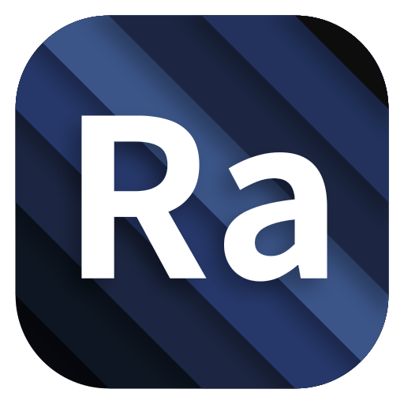
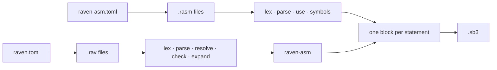

# raven

**Two languages and one target: Scratch 3.**

[](https://github.com/raven-scratch/raven/actions/workflows/ci.yml)
[](https://raven-scratch.github.io/raven/)
[](LICENSE)

<p align="center">
  
</p>

```
raven source (.rav)  ──▶  raven-asm source (.rasm)  ──▶  project.json  ──▶  .sb3
   sugar, types,              one statement,                Scratch 3
   macros                     one block                     file format
```

* **raven-asm** is the assembly level. Its whole design is one rule: *one
  statement is exactly one Scratch block*. No desugaring, no macros, no operator
  overloading, no implicit anything. If you write `motion_movesteps(10);`, the
  compiler writes one `motion_movesteps` block with `STEPS = 10` — nothing else.
* **raven** is the level above. It has `if`, `for`, `while`, `match`, operators,
  string interpolation, typed variables, `let`, `struct`s, `map`s, compile-time
  functions and a macro system — and compiles to raven-asm. Every convenience it
  adds is a macro or a keyword with a written lowering, and `raven expand` prints
  the raven-asm it became. It declares **no Scratch variables a program can
  name**: every value it stores is a cell of the
  [virtual memory system](docs/raven/design.md), at a constant index, and the raw
  name-at-run-time blocks are refused. The single exception is deliberate and
  visible — `watch` declares one mirrored Scratch variable, so a cell can be read
  on the stage.

The arrangement is deliberate. The interesting layer is allowed to exist because
the boring layer underneath it cannot be surprised by it.

## The same program, twice

```rasm
// raven-asm: what you write is what the editor shows
sprite "Player" {
    var score = 0;

    event_whenflagclicked {
        control_forever {
            motion_movesteps(10);
            control_if(operator_gt(motion_xposition(), 100)) {
                looks_say(operator_join("score: ", data_variable("score")));
            };
            data_changevariableby("score", 1);
        }
    }
}
```

```rav
// raven: the same program, with the syntax a text file deserves
sprite "Player" {
    var score: num = 0;

    on flag_clicked {
        forever {
            motion::move_steps(10);
            if motion::x_position() > 100 {
                looks::say(f"score: {score}");
            }
            score += 1;
        }
    }
}
```

`raven expand` shows what the second became. It is not the first: `score` is a
cell of the target's `_vms`, so reading it is a `data_itemoflist` and `score += 1`
is a read, an `operator_add` and a write. `raven build --debug` writes that
raven-asm to disk so `raven-asm build` can produce the identical `.sb3`.

## The workspace

| Crate | What it holds | Depends on |
| --- | --- | --- |
| [`raven-scratch`](crates/raven-scratch) | The Scratch 3 domain model: the 150-block catalog, the `.sb3` container and ZIP writer, deterministic identifiers, asset hashing, diagnostics. | — |
| [`raven-asm`](crates/raven-asm) | The assembly-level language and compiler, its CLI, and the generated block reference. | `raven-scratch` |
| [`raven`](crates/raven) | The high-level language and compiler. | `raven-scratch`, `raven-asm` |

Dependencies only ever point right, so a front end cannot be surprised by the
layer above it.

## Install

```sh
git clone https://github.com/raven-scratch/raven
cd raven
cargo install --path crates/raven-asm
cargo install --path crates/raven
```

## Use

```sh
raven-asm new hello       # scaffold a project: two targets, no scripts yet
cd hello
raven-asm check           # parse and validate, write nothing
raven-asm build           # write dist/hello.sb3
raven-asm build --debug   # also write dist/project.json to inspect
raven-asm catalog         # every block raven-asm understands
```

| Command | Purpose |
| --- | --- |
| `raven-asm new <name>` | Create a project (`--here`, `--force`, `--with-module`). |
| `raven-asm init [path]` | Scaffold into an existing directory (`--force`). |
| `raven-asm build` | Compile to `dist/<name>.sb3` (`--debug`, `--strict`, `-m <manifest>`). |
| `raven-asm check` | Validate without writing (`--strict`). |
| `raven-asm clean` | Remove the output directory. |
| `raven-asm catalog` | Print the block catalog (`--json`, `--markdown`, `-c, --category <text>`). |

And the high-level tool, which writes the same kind of project:

```sh
raven new hello           # the same project, in raven
cd hello
raven check               # parse, resolve, type check and expand; write nothing
raven build               # write dist/hello.sb3
raven expand              # print the raven-asm this program became
raven build --debug       # also dist/asm/ and dist/project.json
raven fmt --check         # canonical indentation, without writing
```

| Command | Purpose |
| --- | --- |
| `raven new <name>` | Create a project (`--here`, `--force`, `--with-module`). |
| `raven init [path]` | Scaffold into an existing directory. |
| `raven build` | Compile to `dist/<name>.sb3` (`--debug`, `-m <manifest>`). |
| `raven check` | Run every front-end stage without writing. |
| `raven expand` | Print the raven-asm the project lowers to. |
| `raven explain [section]` | Print the language reference written for a machine reader. |
| `raven fmt` | Canonical indentation and blank lines (`--check`). |
| `raven clean` | Remove the output directory. |

## What raven-asm covers

* **Blocks** — the complete core palette: Motion, Looks, Sound, Events, Control,
  Sensing, Operators, Variables, Lists and My Blocks, plus the bundled **Pen**
  and **Music** extensions. 150 blocks, listed in the
  [block reference](https://raven-scratch.github.io/raven/reference/blocks).
* **Custom blocks** — `proc` definitions with string, number and boolean
  parameters, including `warp`, and the exact `procedures_prototype` /
  `procedures_call` mutations Scratch expects.
* **Multi-file projects** — one stage, any number of sprite files, and `use` for
  sharing procedure definitions. `use` is *inclusion*, not name import: a Scratch
  custom block belongs to one target, so the module is copied into each user.
  Project-wide state is the exception — a module declares it with `global`, it
  lands on the stage, and every user shares one instance.
* **Variables and lists** — sprite-local and stage-global, with the scope written
  where it is declared, so a module can never mean two different things to two
  users. Monitor records are written too, so `data_showvariable` works.
* **Assets** — SVG, PNG, JPG, BMP and GIF costumes; WAV and MP3 sounds, hashed
  and packed for you, with rotation centres worked out from the image.
* **Reproducible builds** — identifiers are derived deterministically and the ZIP
  timestamp is pinned, so the same source always produces the same bytes.

## What raven adds

The language is specified in [`docs/raven/`](docs/raven/), and the specification
is the contract. It is implemented — `raven build` writes a working `.sb3`:

* **Expressions** — Rust's operators and precedence, lowered one block each.
* **Control flow** — `if`/`else`, `repeat`, `repeat_until`, `forever`, `while`,
  `for`, `match`. `while` and `for` are prelude macros; `match` is a keyword with
  a one-line lowering. Every one of them is printable.
* **Types** — `num`, `str`, `bool`, `list<T>`, `map<K, V>` and declared `struct`s,
  checked, with shapes taken from the block catalog: a string in a numeric slot is
  a compile error. Two free, explicit conversions and no others. A `bool` lives in
  a cell, a list or a map like any other value; Scratch has no `true`/`false`
  block, so a literal is the constant comparison `<1 = 1>` and a stored boolean is
  read back as `<value = "true">`.
* **The virtual memory system** — every `var`, `let`, `for` counter and returned
  value is a cell addressed by a constant index the compiler picks, and the
  memory is **dynamic**: a script's block-scoped cells live on its own stack
  (`_stack1`, `_stack2`, …), pushed when their declaration runs and popped when
  their block ends, while `var`s and procedure frames live in an arena (`_vms`,
  or `_gvm` on the stage) that is declared empty and grown on demand. A program
  cannot name a Scratch variable — the five blocks that do are refused with an
  explanation — and the only Scratch variable a project gets is the mirror `watch`
  asks for. A `struct` is a *place*:
  a fixed frame of cells, so `line.to.x` is one block and cannot be copied. A
  `map` is one list of alternating keys and values, reached through `get`, `set`,
  `has` and `remove`.
* **`fn` and `macro`** — compile-time, hygienic, acyclic, and inlined at every
  call site, so they cost nothing at run time.
* **Returning `proc`s** — `proc f(a: num) -> num { return a + 1; }`. `return` is
  a real `control_stop`, and the value travels through a printed `_vms` cell that
  the call site reads back.
* **A typed standard library** — all 150 catalog blocks, namespaced and typed,
  with dropdowns as enum types and a totality test that fails the build when the
  catalog gains a block the binding does not cover. Five of the 150 are bound only
  to be refused — they are the name-a-Scratch-variable blocks — and each refusal
  says what to write instead. An unambiguous block may also be called by its bare
  name.
* **A console and watches** — console::log(x) appends one line to _console,
  a Scratch list the stage declares only when something logs, and whose monitor
  the developer shows when wanted. watch score;
  puts a VMS cell on the stage: a Scratch variable whose monitor starts visible,
  kept in step by every write to the cell.
* **Visible cost** — `raven expand` prints the raven-asm; `raven build --debug`
  writes it to `dist/asm/` as a project `raven-asm` can build on its own, plus
  `dist/project.json`. A plain `raven build` writes the `.sb3` and nothing else.

## Try it

`raven new hello` writes a project that compiles and runs: a stage, a sprite, one
`let`, and a working `.sb3` three commands later. `raven-asm new hello` writes the
same two targets with no scripts at all, so the first block you write is yours.

```sh
raven new hello
cd hello
raven check       # parse, resolve, type check, expand
raven build       # dist/hello.sb3
```

## Documentation

The full guide for both languages is in [`docs/`](docs/) and is published with
VitePress at <https://raven-scratch.github.io/raven/>. Pages pair a source fence
with the Scratch blocks it produces, so the mapping is visible where it is
described rather than one page away.

* [raven and raven-asm](docs/guide/index.md) — how the pieces fit together
* [Getting started](docs/guide/getting-started.md)
* [What is raven-asm?](docs/raven-asm/index.md)
* [What is raven?](docs/raven/index.md) and its [design laws](docs/raven/design.md)
* [Block reference](docs/reference/blocks.md)

To read it locally:

```sh
cd docs
npm install
npm run dev
```

The block reference is generated, so it cannot drift: `raven-asm catalog
--markdown` prints it, and `docs/reference/blocks.md` is checked in already
generated. `raven explain` is the same idea for a machine reader — see
[For LLMs](docs/guide/for-llms.md).

## How it works



| File | Role |
| --- | --- |
| `crates/raven-scratch/src/catalog.rs` | The block table: opcode, inputs, fields, shape, docs. The language lives here. |
| `crates/raven-scratch/src/sb3.rs`, `zipw.rs` | The Scratch file format and a dependency-free ZIP writer. |
| `crates/raven-asm/src/compile.rs` | Source files to `project.json`: symbol resolution, block emission, procedures, monitors. |
| `crates/raven-asm/src/parser.rs`, `lexer.rs` | The grammar. |
| `crates/raven-asm/src/manifest.rs`, `scaffold.rs` | `raven-asm.toml` and `raven-asm new`. |
| `crates/raven-asm/src/docs_gen.rs` | Generates the block reference from the catalog. |
| `crates/raven/src/lexer.rs`, `parser.rs` | raven's grammar. |
| `crates/raven/src/lower.rs` | The whole front end: names, types, macros and the descent to raven-asm, in one traversal. |
| `crates/raven/src/stdlib.rs` | Binds every catalog block to its raven name, with a totality test. |
| `crates/raven/src/menu.rs`, `purity.rs`, `ty.rs` | Dropdowns as types, the pure/sampled classification, and the type model. |
| `crates/raven/src/rasm.rs` | Prints raven-asm source; round-trips through raven-asm's own parser in its tests. |
| `crates/raven/src/driver.rs` | Writes the staging project and hands it to raven-asm. |
| `crates/raven/src/prelude.rav` | The prelude, written in raven. |

Adding a new block is a one-row change to `catalog.rs`; it then compiles,
validates, appears in the documentation, and the `raven` test suite fails until
it is bound in `crates/raven/src/stdlib.rs`.

raven-asm's behaviour can also be checked against the real
[raven-scratch/scratch-editor](https://github.com/raven-scratch/scratch-editor)
virtual machine with `tools/validate-sb3.js`, by hand and outside CI: it loads a
generated project into the VM, checks that every opcode is one the runtime knows,
runs the green-flag scripts and serializes the result back. raven's output can go
through the same check, because raven hands raven-asm a whole project rather than
a `project.json`.

## Relation to Scrust

[Scrust](https://github.com/DilemmaGX/Scrust) was the earlier attempt at this
idea. It accumulated several layers of syntax sugar, which made the compiler hard
to keep extending and the generated projects hard to reason about. This repository
splits the problem instead of abandoning it: raven-asm is the exact layer, and
raven is the sugar layer, with the sugar written as macros so its cost is always
visible. See [Why no syntax sugar](docs/raven-asm/design.md) and
[Coming from Scrust](docs/raven/from-scrust.md).

## Contributing

Issues and pull requests are welcome. Before opening a PR:

```sh
cargo fmt --all --check
cargo clippy --workspace --all-targets
cargo test --workspace
```

Two rules keep the design intact:

* **raven-asm never rewrites.** A feature that requires turning one construct
  into several blocks does not belong there; it belongs in raven, as a macro.
* **raven never hides.** A feature that cannot be printed by `raven expand` is
  not finished. A convenience whose shape is fixed belongs in
  [`prelude.rav`](crates/raven/src/prelude.rav) as an ordinary macro, not in the
  compiler as a special case.

## Renaming

Every name the workspace answers to is declared once, so a rename is a short list
of edits rather than a search-and-replace:

| Place | What to change |
| --- | --- |
| `crates/raven-scratch/src/identity.rs` | `ORG`, `REPOSITORY_NAME`, `REPOSITORY`, `DOCS` — shared by every crate |
| `crates/raven-asm/src/identity.rs` | `CRATE`, `DISPLAY`, `MANIFEST`, `SOURCE_EXTENSION` |
| `crates/raven/src/identity.rs` | the same, for the high-level language |
| `*/Cargo.toml` | `name`, `[[bin]] name` |
| `Cargo.toml` | `[workspace.package]` `repository`, `homepage`, `documentation` |
| `.github/workflows/*.yml` | the badge URLs in `ci.yml` and the Pages `base` in `docs.yml` |
| `docs/.vitepress/config.mts` | `title`, `base`, the GitHub social link |
| `docs/**`, `README.md` | prose; the two *languages* are still called raven and raven-asm unless you rename those too |

The compilers, the CLIs, the scaffold and the manifest readers all read their
names from those `identity` modules, so changing a binary name, a manifest
filename or a source extension does not require hunting for string literals.

## License

[MIT](LICENSE) © DilemmaGX
