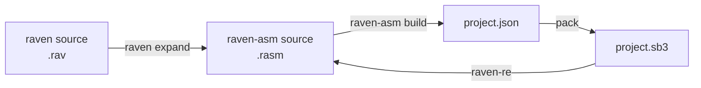

## Pick a language

They share one target and one repository. The difference is how much you want to
write by hand.

<div class="paths">
<div class="path">

**[raven-asm](/raven-asm/)**

Spell the block. One statement is exactly one Scratch block, and the compiler
never rewrites anything — so the project you open in Scratch is the project you
wrote, line for line.

[Start with raven-asm](/raven-asm/)

</div>
<div class="path">

**[raven](/raven/)**

Spell the idea. Expressions, control flow, declared types, compile-time functions
and a macro system. It compiles to raven-asm, and `raven expand` prints exactly
what each construct cost.

[Start with raven](/raven/)

</div>
<div class="path">

**[raven-re](/raven-re/)**

Read it back. A vanilla Scratch 3 `.sb3` becomes the raven-asm project that
reproduces it — one statement per block — and the result is compiled before the
tool exits.

[Reverse a project](/raven-re/)

</div>
</div>

Not sure? [Getting started](/guide/getting-started) builds a project with both,
and [raven and raven-asm](/guide/) explains how they fit together.

## How it works



You can also start at the second box: `raven-asm` is a complete language on its
own and never needs `raven` above it. That is the one direction the workspace
depends on, and it is why a raven bug can never change what a raven-asm
statement means.

Because one statement is exactly one block, the last arrow is reversible:
[`raven-re`](/raven-re/) reads a vanilla Scratch 3 `.sb3` and writes the
raven-asm that reproduces it, refusing a project whose blocks the language cannot
spell.

| Stage | Command | What it guarantees |
| --- | --- | --- |
| raven → raven-asm | `raven expand` | Every macro, every `_vms` cell, every block it will cost. |
| raven-asm → `.sb3` | `raven-asm build` | One statement is one block. The project you open in Scratch is the project you wrote. |
| `.sb3` → raven-asm | `raven-re` | One block is one statement, and the result compiles. |

## The same program, twice

raven-asm spells the block; raven spells the idea, and can always show you the
block.

<div class="cmp">
<div class="cmp-col">
<h4>raven-asm</h4>

```rasm
// what you write is what the editor shows
sprite "Player" {
    var score = 0;

    event_whenflagclicked {
        control_forever {
            motion_movesteps(10);
            control_if(operator_gt(motion_xposition(), 100)) {
                looks_say(operator_join("score: ", data_variable("score")));
            };
            data_changevariableby("score", 1);
        }
    }
}
```

</div>
<div class="cmp-col">
<h4>raven</h4>

```rav
// the same program, with the syntax a text file deserves
sprite "Player" {
    var score: num = 0;

    on flag_clicked {
        forever {
            motion::move_steps(10);
            if motion::x_position() > 100 {
                looks::say(f"score: {score}");
            }
            score += 1;
        }
    }
}
```

</div>
</div>

Give the second program to the second tool and `raven expand` prints exactly
what it became: the same statements, one block each, with the cell reads and
writes the first program spelled by hand the only difference. raven adds no
hidden state and no Scratch variable, which is what makes it safe to have both.

## Where to go next

| Page | What it covers |
| --- | --- |
| [Getting started](/guide/getting-started) | Install the tools, build a first project, open it in Scratch. |
| [For LLMs](/guide/for-llms) | `raven explain`, and the check/expand/build loop for a model writing raven. |
| [What is raven-asm?](/raven-asm/) | The one-block rule, the manifest, the command line. |
| [What is raven?](/raven/) | What the high-level language adds, and what it refuses to add. |
| [What is raven-re?](/raven-re/) | Reading a `.sb3` back, what is refused, and what has no raven-asm spelling. |
| [Design laws](/raven/design) | The rules the sugar is not allowed to break. |
| [From raven to Scratch](/raven/lowering) | What every construct becomes, block by block. |
| [Block reference](/reference/blocks) | Every block either language can reach. |
