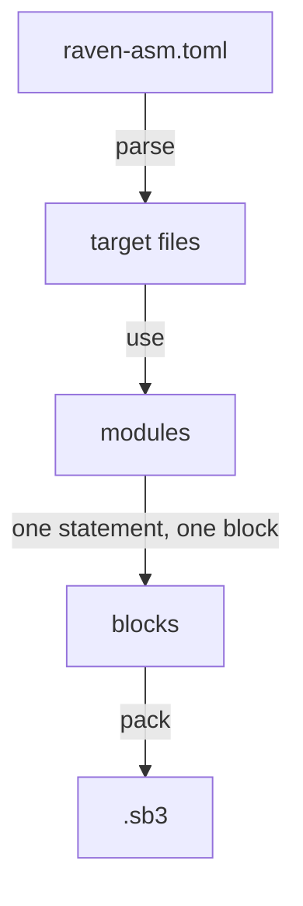

# What is raven-asm?

raven-asm is a small programming language that compiles to **Scratch 3 project
files** (`.sb3`). It is designed around a single rule:

> **One raven-asm statement is exactly one Scratch block.**

There are exactly two statements that are not, and both are named
[in the reference](/raven-asm/blocks#procedures): a `proc` definition, which
Scratch stores as a `procedures_definition` holding a `procedures_prototype`
shadow, and a call to it, which is a `procedures_call` with a mutation. Nothing
else is ever rewritten.

There is no desugaring step, no macro system, no operator overloading, no
implicit variable creation and no clever rewriting. When you write

```rasm
motion_movesteps(10);
```

the compiler writes one `motion_movesteps` block with `STEPS = 10`. Nothing else.

## Why that rule exists

Most "programming language for Scratch" projects grow a second language on top
of the first: `for` loops expand to `repeat` + a counter variable, `x += 1`
becomes `change x by 1`, string interpolation becomes a tower of `join` blocks,
and functions get inlined by a template engine. Each of those layers is pleasant
on its own, but they compose badly — the generated project stops resembling the
source, error messages stop pointing at anything real, and every new feature has
to interact with every layer that came before.

raven-asm takes the opposite position. It keeps Scratch's own vocabulary and only
adds what a *text file* needs that a block canvas does not:

* names and files, so projects can be reviewed and version-controlled;
* a manifest, so a project can hold many targets;
* `use`, so procedures can be shared;
* declarations for variables, lists, broadcasts, costumes and sounds;
* real error messages with line numbers.

Everything else is the Scratch block itself, spelled with its real opcode.

## What raven-asm is not

* It is **not** a way to avoid learning Scratch.** If you know what
  `control_repeat_until` does, you know what `control_repeat_until(cond) { … }`
  does in raven-asm.
* It is **not** a superset of Scratch. If Scratch cannot represent it, raven-asm
  cannot compile it.
* It is **not** Scrust. [Scrust](https://github.com/DilemmaGX/Scrust) explored
  richer syntax and stalled under the weight of its own sugar layers; raven-asm is
  the deliberate opposite experiment. The [design notes](/raven-asm/design) go into this
  in more detail.
* It is **not** the only language here. [raven](/raven/) is the layer *above*
  this one: it has types, macros and expressions, it compiles to raven-asm, and
  `raven expand` prints the raven-asm it produced. Use raven-asm directly when
  you want to know exactly what the project contains, and raven when you would
  rather write `if score > 100 { }` and check afterwards.

## What you get

| | |
| --- | --- |
| Output | Standard `.sb3` files, loadable in the Scratch editor, TurboWarp and compatible players |
| Targets | One stage, any number of sprites, each in its own file |
| Blocks | The complete core palette plus the Pen and Music extensions |
| Custom blocks | `proc` definitions with string, number and boolean parameters, including `warp` |
| Variables | Sprite-local and stage-global variables and lists, with monitor records |
| Broadcasts | Project-wide messages |
| Assets | SVG, PNG, JPG, BMP and GIF costumes; WAV and MP3 sounds, hashed and packed for you |
| Errors | Unknown blocks, arity, dropdown values, undeclared variables, unreachable code, module cycles |

## How a project is compiled



Each stage is described in the [guide](/raven-asm/). If you would rather read code,
the compiler is a few thousand lines of Rust; `crates/raven-asm/src/compile.rs` holds the
statement-to-block mapping and `crates/raven-scratch/src/catalog.rs` holds the block table that both
the compiler and the [block reference](/reference/blocks) are generated from.
