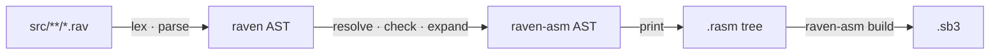

# What is raven?

raven is a programming language for Scratch 3. It is Rust-inspired in syntax and
strictly ruled in behaviour, and it compiles to [raven-asm](/raven-asm/), which
compiles to a `.sb3`.

Its one promise:

> **Every convenience in raven is a rewrite, and every rewrite can be printed.**

```rav
sprite "Player" {
    costume "idle" = "assets/idle.svg";
    var score: num = 0;

    proc zigzag(degrees: num, steps: num) warp {
        motion::turn_right(degrees);
        motion::move_steps(steps);
    }

    proc clamp(value: num, low: num, high: num) -> num {
        if value < low { return low; }
        if value > high { return high; }
        return value;
    }

    on flag_clicked {
        let speed = clamp(3, 5, 10);
        forever {
            zigzag(15, speed);
            motion::if_on_edge_bounce();
            if motion::x_position() > 100 {
                looks::say(f"score: {score}");
            } else {
                score += 1;
            }
            control::wait(0.05);
        }
    }
}
```

Ask `raven expand` what that is and it answers with the raven-asm it became —
including the two blocks the `f"…"` interpolation cost and the four the `let` and
the value-returning `clamp` call cost. Nothing in a raven build happens at a
stage you cannot look at.

## What raven adds over raven-asm

| | raven-asm | raven |
| --- | --- | --- |
| Names | the Scratch opcode | a typed, namespaced name from the catalog |
| Arithmetic | `operator_add(operator_multiply(x, 2), 1)` | `x * 2 + 1` |
| Conditions | `control_if(operator_gt(x, 100)) { … }` | `if x > 100 { … }` |
| Assignment | `data_changevariableby("score", 1)` | `score += 1;` — three blocks, on a cell of `_vms` |
| Text | `operator_join("score: ", data_variable("score"))` | `f"score: {score}"` — and a raven program cannot write the first |
| Repetition | `control_repeat(10) { … }` | `repeat 10 { … }` |
| Named expressions | `proc` only, and it cannot return a value | `fn`, inlined, and `proc`, which can |
| Shared code | `use "path";` copies a procedure | modules with `pub`, plus macros that cost nothing |
| Types | checked per block argument | checked across the whole program |
| Errors | line and column | line and column, plus the expansion that produced it |

And what it deliberately does **not** add is the more important list — no Scratch
variables at all, no hidden state, no dynamic allocation, no short-circuit
operators, no compile-time evaluation. Every `var`, `let`, `for` counter and
return value is a cell of [`_vms` or `_gvm`](/raven/design#_7-there-is-no-raw-variable-access-only-the-virtual-memory-system),
and every access to one is a block `raven expand` prints. Each refusal is argued
in the [design laws](/raven/design).

## The three ways to make a value

raven has exactly three kinds of callable, and the difference between them is the
whole language:

| Form | Expands | Can contain statements | Costs |
| --- | --- | --- | --- |
| `macro` | at compile time | yes | whatever it expands to, shown by `raven expand` |
| `fn` | at compile time | no — a single expression | nothing beyond the expression itself |
| `proc` | never — it becomes a real Scratch custom block | yes | one custom block, shared by every caller |

There is no fourth kind. A `proc` may declare a result type — that is a cell in
`_vms` plus a `control_stop`, not a hidden call stack — and a call that uses the
value is hoisted one statement so you can see the read. See
[macros](/raven/macros) for the expansion rules and
[design laws](/raven/design#value-returning-procedures) for the cost.
## The compilation pipeline



Macro expansion and type checking happen in the same pass, because a macro
argument's type decides whether its expansion is legal.

Every stage is a distinct module in the `raven` crate, and the whole raven-asm
program is a value you can ask the CLI to print. `raven build --debug` writes
it to disk as a `.rasm` tree you can feed straight back to `raven-asm`.

## What you get

| | |
| --- | --- |
| Output | Standard `.sb3` files, loadable in the Scratch editor, TurboWarp and compatible players |
| Targets | One stage, any number of sprites, each in its own file |
| Blocks | Every block of the core palette plus Pen and Music, typed and namespaced — and the extended control blocks too, warned about because vanilla Scratch has no `control_while` |
| Custom blocks | `proc` with `str`, `num` and `bool` parameters, an optional result type, and `warp` |
| Compile-time functions | `fn`, inlined at every call site, with declared parameter and return types |
| Macros | Typed, hygienic, acyclic, and printable |
| Variables | `var` is sprite-local or project-wide, declared once, never shadowed |
| Locals | `let`, `var`, a `for` counter and a `struct` field are all cells — on the script's `_stackN` outside a `proc`, in `_vms` inside one, or `_gvm` for a `pub var` — with lexical shadowing and no nameable Scratch variable anywhere |
| Structs | `struct Point { x: num, y: num }` — a fixed frame of cells, a *place* rather than a value, so a field is one block at a constant offset |
| Maps | `map<K, V>` — one Scratch list of alternating keys and values, with `get`, `set`, `has`, `remove`, `len` and `clear` |
| Lists | `list<T>`, indexed with `l[i]`, with the whole Scratch list vocabulary |
| Assets | SVG, PNG, JPG, BMP and GIF costumes; WAV and MP3 sounds |
| Errors | Every diagnostic raven-asm has, plus macro expansion traces |

## Where to go next

| Page | What it covers |
| --- | --- |
| [Design laws](/raven/design) | The twelve rules the compiler is not allowed to break, including the memory system. |
| [Syntax](/raven/syntax) | The whole grammar, and the two decisions it makes. |
| [Types and shapes](/raven/types) | `num`, `str`, `bool`, `list<T>`, `map<K, V>`, `struct`, and the blocks each one fits. |
| [Macros](/raven/macros) | The only expansion mechanism, and why it is total. |
| [Standard library](/raven/std) | How the catalog becomes a typed API. |
| [From raven to Scratch](/raven/lowering) | The exact lowering, block by block, with a worked example. |
