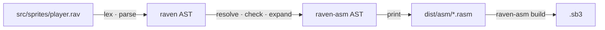

# From raven to Scratch

raven lowers to raven-asm, and raven-asm lowers to Scratch — one statement, one
block. This page is the receipt: the whole chain for one program, with the cost of
every construct.

## The chain



`raven expand` prints the raven-asm AST. `raven build --debug` writes the same
thing to `dist/asm/` and `dist/project.json` beside it, so you can hand the result
to `raven-asm build` and get the same project.

## A worked program

```rav
// src/sprites/player.rav
sprite "Player" {
    var score: num = 0;

    on flag_clicked {
        repeat 3 {
            motion::move_steps(10);
            score += 1;
        }
        if score > 2 {
            looks::say(f"done: {score}");
        }
    }
}
```

**After expansion** (`raven expand`) the program is this raven-asm, and in the
editor those are the same blocks — a hat, a `repeat` and an `if`, plus one small
custom block that grows the arena:

<div class="cmp">
<div class="cmp-col">
<h4>raven-asm</h4>

```rasm
sprite "Player" {
    list _vms = [];

    event_whenflagclicked {
        __vms_reserve;
        control_repeat(3) {
            motion_movesteps(10);
            data_replaceitemoflist(1, "_vms", operator_add(data_itemoflist(1, "_vms"), 1));
        }
        control_if(operator_gt(data_itemoflist(1, "_vms"), 2)) {
            looks_say(operator_join("done: ", data_itemoflist(1, "_vms")));
        }
    }

    proc __vms_reserve() warp {
        control_if(operator_lt(data_lengthoflist("_vms"), 1)) {
            control_repeat_until(operator_not(operator_lt(data_lengthoflist("_vms"), 1))) {
                data_addtolist("", "_vms");
            }
            data_replaceitemoflist(1, "_vms", 0);
        }
    }
}
```

</div>
<div class="cmp-col">
<h4>Scratch</h4>

<pre class="blocks" v-pre>
when green flag clicked
repeat (3)
    move (10) steps
    replace item (1) of [_vms v] with ((item (1) of [_vms v]) + (1))
if <(item (1) of [_vms v]) > (2)> then
    say (join [done: ] (item (1) of [_vms v]))
</pre>

</div>
</div>

Two constructions cost something beyond a direct spelling:

* `score` is not a Scratch variable, so `score += 1` is three blocks: a read of
  its cell, an `operator_add`, and a write back. There is no `change [score] by
  (1)` to be had, because there is no variable for it to name;
* `f"done: {score}"` is one `operator_join` per piece after the first — here, one
  join, because `score` is in the second slot.

The arena is the third: `list _vms = [];` is declared **empty**, and the
`__vms_reserve` call at the top of the hat grows it to the size the target needs
the first time the script runs. That is why the number of blocks a program costs
does not depend on how many cells it uses — the memory is asked for at run time
rather than paid for at compile time.

Nothing else was rewritten. `repeat` is `control_repeat`, `if` is `control_if`,
`motion::move_steps` is `motion_movesteps`.

## The cost table

Every construct in the language, and what it becomes. "Blocks" counts the blocks
the construct adds *beyond* the code you wrote inside it.

### Statements

| raven | raven-asm | Blocks added |
| --- | --- | --- |
| `let x = e;` | `data_addtolist(e, "_stack1");` — a **push** on the script's stack | 1, and one cell until the block ends |
| `let x: T = e;` | the same, with `e` checked against `T` | |
| the end of a block that pushed `k` cells | `data_deleteoflist(N, "_stack1");` × `k` | `k` |
| `x = e;` where `x` is a `var` | `data_replaceitemoflist(N, "_vms", e);` | 1 |
| `x = e;` where `x` is a `let` | the same, on the cell the binding names | 1 |
| `x = e;` where `x` is a `pub var` | `data_replaceitemoflist(N, "_gvm", e);` | 1 |
| `x = e;` where `x` is a `bool` | the same, storing the comparison's value | 1, and `<value = "true">` on every read |
| `x += e;` | `data_replaceitemoflist(N, A, operator_add(data_itemoflist(N, A), e));` | 3 |
| `x -= e;`, `x *= e;`, `x /= e;`, `x %= e;` | the same shape with `operator_subtract`, `operator_multiply`, `operator_divide`, `operator_mod` | 3 |
| `l[i] = e;` | a grow to index `i` (an `if`, a `repeat_until` and a `data_addtolist`), then `data_replaceitemoflist(i, "l", e);` | 5 for the grow, 1 for the replace |
| `p.x = e;` | `data_replaceitemoflist(N, "_vms", e);`, where `N` is the field's constant offset | 1 |
| `l.push(e);` | `data_addtolist(e, "l");` | 1 |
| `l.pop();` | `data_deleteoflist(data_lengthoflist("l"), "l");` | 2 |
| `l.insert(i, e);` | `data_insertatlist(e, i, "l");` | 1 |
| `l.remove(i);` | `data_deleteoflist(i, "l");` | 1 |
| `l.clear();` | `data_deletealloflist("l");` | 1 |
| `m.set(k, v);` | `item # of k in m` into a cell, then an `if`/`else` that replaces the pair or appends it | 6, and one cell |
| `m.remove(k);` | the same lookup, then an `if` around two `data_deleteoflist` | 5, and one cell |
| `return e;` | `data_replaceitemoflist(R, "_vms", e);` then `control_stop("this script");` | 2 |
| `return;` | `control_stop("this script");` | 1 |
| `if c { A }` | `control_if(c) { A }` | 1 |
| `if c { A } else { B }` | `control_if_else(c) { A } else { B }` | 1 |
| `repeat n { A }` | `control_repeat(n) { A }` | 1 |
| `repeat_until c { A }` | `control_repeat_until(c) { A }` | 1 |
| `forever { A }` | `control_forever { A }` | 1 |
| `while c { A }` | `control_repeat_until(operator_not(c)) { A }` | 2 |
| `for i in a..b { A }` | a cell write for `i`, `control_repeat_until(operator_not(operator_lt(item("i"), b))) { A; a read, an add and a cell write for `i` }` | 9, and one cell |
| `match e { k => A, _ => B }` | `control_if_else(operator_equals(e, k)) { A } else { B }` | 1 per arm, plus 1 and a cell when `e` is read into one first |
| `control::stop(StopOption::All);` | `control_stop("all");` | 1 |
| `some_proc(a, b);` | a `procedures_call` with a matching mutation | 1 |
| `motion::move_steps(10);` | `motion_movesteps(10);` | 1 |

`let`, `for` and `var` are what introduce state, and none of them adds anything to
the project's variable list, because a raven project has no variable list: a `var`
writes a cell of `_vms` (or `_gvm` for a `pub var`), while a `let` and a `for`
counter outside a `proc` are pushed on the script's own `_stackN` and popped when
their block ends. A `let` in a script is therefore gone when the block is; a `let`
in a `proc` is a `_vms` cell instead, because the stack belongs to the script.

`for` is a macro, so the counter it declares is in its expansion where you can see
it, and it is the name you wrote, so `for i in 0..3` gives you an `i` you can read
afterwards — from the `_stackN` cell the expansion pushed.

`==` inside a `match` arm is Scratch's `=`, so the comparison is numeric when both
sides look like numbers and case-insensitive otherwise. The subject is read **once**
and compared against the arms: when it is not duplicable — a sensor, or a map
`get` — and there is more than one arm, it is written into a fresh `_vms` cell
before the chain, so `match sensing::timer()` cannot have two arms disagree. A
literal, an operator over literals, or a variable (which is already a cell) keeps
the plain chain and costs nothing extra.

### Expressions

Every expression is reporter blocks, and every level of the tree is exactly one
block:

| raven | Blocks |
| --- | --- |
| `10`, `"x"` | 0 — a literal input, not a block |
| `true`, `false` | 1 — Scratch has no boolean literal, so it is `<1 = 1>` / `<1 = 0>` |
| a `bool` read out of a cell, a list item or a map value | 1 — the read, wrapped in `<value = "true">` |
| a stack cell read, written, pushed or popped | 1, like any other cell |
| `score` where `score` is a `var` | 1 — `data_itemoflist` on its cell |
| `total` where `total` is a `let` | 1 — `data_itemoflist` on its `_vms` cell |
| `motion::x_position()`, or `x_position()` | 1 |
| `a + b`, `a * b`, `a - b`, `a / b`, `a % b` | 1 each |
| `-a` | 1 — `operator_subtract(0, a)` |
| `a == b`, `a < b`, `a > b` | 1 each |
| `a != b`, `a <= b`, `a >= b` | 2 each — Scratch has no `≠`, `≤`, `≥` |
| `a && b`, `a \|\| b` | 1 each — and both operands are evaluated |
| `!a` | 1 |
| `l[i]` | 1 |
| `p.x` where `p` is a struct | 1 — a cell read at a constant offset |
| `seg.to.x` where `to` is a struct field | 1 — two offsets added at compile time |
| `l.len()`, `l.at(i)`, `l.first()`, `l.contains(v)`, `l.index_of(v)` | 1 each |
| `l.last()` | 2 — `item (length of l) of l` |
| `l.text()` | 1 — `data_listcontents`, the whole list as one string |
| `l.is_empty()`, `m.is_empty()` | 2 |
| `m.has(k)` | 2 — `item # of k in m` compared to zero |
| `m.len()` | 2 — the list's length over two |
| `m.get(k)` | 5 — two cells and a guarded read (see below) |
| `f"…{a}…{b}…"` | one `operator_join` per piece after the first |
| `hypot(3, 4)` where `hypot` is an `fn` | however many blocks its body needs — here, four |
| `f(x)` where `f` is a `proc` with a result type | the call, then a cell copy and a read — 2 blocks beyond the call itself |
| `num(x)`, `str(x)` | 0 — a retype |

### Definitions

| raven | raven-asm | Notes |
| --- | --- | --- |
| `proc p(a: num) { }` | `procedures_definition` + a `procedures_prototype` shadow with a mutation | plus one reporter per parameter *use* |
| `proc p(a: num) warp { }` | the same, with `warp: true` in the mutation | |
| `proc p(a: num) -> T { }` | the same, plus one `_vms` cell for the result | a `return` costs what the table above says |
| `fn f(…) -> T { e }` | *nothing* — each call is inlined | only the call site's blocks exist |
| `macro m(…) -> … { … }` | *nothing* — each call is expanded | only the expansion's blocks exist |
| `on flag_clicked { }` | `event_whenflagclicked` | 1 |
| `on key_pressed(Key::Space) { }` | `event_whenkeypressed` with a key shadow | 2 |
| `on broadcast_received("go") { }` | `event_whenbroadcastreceived` | 1 |

A `proc` is emitted once per target that calls it, and only if it is called. A
`proc` nothing calls does not appear in the project at all.

### Declarations

| raven | Effect in the project | Blocks |
| --- | --- | --- |
| `var x: num = 0;` | one cell of `_vms`, which the memory manager grows to fit | 0 |
| `pub var x: num = 0;` | one cell of `_gvm`, the arena the stage declares | 0 |
| `var l: list<num> = [];` | an entry in the target's `lists`, plus a list monitor | 0 |
| `var p: Point = Point { x: 0, y: 0 };` | one cell per field, in declaration order, started from the literals | 0 |
| the first arena cell a target uses | `_vms`, declared **empty**, plus the `warp` memory manager that grows it on demand | 0 |
| the first block-scoped cell a script uses | `_stack<n>`, declared **empty**: it holds exactly the cells alive right now | 0 |
| the first project-wide cell | one list, `_gvm`, declared on the stage | 0 |
| `struct Point { x: num, y: num }` | *nothing* on its own — a shape, not storage | 0 |
| `const N: num = 4;` | *nothing* — substituted at each use | 0 |
| `costume "idle" = "assets/idle.svg";` | a costume, hashed and packed | 0 |
| `sound "beep" = "assets/beep.wav";` | a sound, hashed and packed | 0 |
| `broadcast "go";` | a broadcast name, once, on the stage | 0 |
| `use lib::geometry::square;` | a copy of the `proc` in this target | 0 at the import |

A program that declares no state at all does not declare `_vms`, and looks exactly
like a raven-asm project of the same shape. Nothing a program *writes* can name a
Scratch variable; the one it can declare is the mirror `watch` asks for, and that
exists to be looked at. A `bool` is kept like anything else, converted back into a
block when it is read; see
[types](/raven/types#booleans-stored-as-a-value-converted-on-the-way-out).

### Where a cell is spent, and why a map is the expensive one

A scalar costs one cell. A struct costs one per field, nested structs included,
and every access to one is a single block.

A `map` is the one construct whose cost is not obvious. `set` and `remove` need
the key's position twice — once to test it, once to use it — so it goes into a
cell; `get` cannot simply be `item # of` and a read, because a missing key has
position 0 and `item 1 of` a list is the first *key* at an even position, not its
value. So `get` is a cell holding the position, a cell holding the answer, and a
`control_if` that fills the second from the first when the position is not zero:

```rasm
data_replaceitemoflist(I, "_vms", data_itemnumoflist(k, "m"));
data_replaceitemoflist(T, "_vms", "");
control_if(operator_gt(data_itemoflist(I, "_vms"), 0)) {
    data_replaceitemoflist(T, "_vms", data_itemoflist(operator_add(data_itemoflist(I, "_vms"), 1), "m"));
}
```

Five blocks for a lookup — plus the read that uses the answer — is the honest
price of a table that is one Scratch list and two cells rather than a hidden
dictionary.

## Reproducibility

The lowering is deterministic in the strong sense that raven-asm guarantees:

* every Scratch identifier is derived from the content of the declaration that
  produced it, so identifiers do not depend on hash-map iteration order;
* a macro-generated name is derived from the macro's name and the expansion
  index, so the same program produces the same generated names;
* a `_vms` or `_gvm` cell index is handed out in source order, so the same program
  produces the same cells;
* `project.json` keys are ordered, and the ZIP timestamp is pinned.

The test that proves it is the one raven-asm already has, applied to raven: build
twice, compare bytes.
